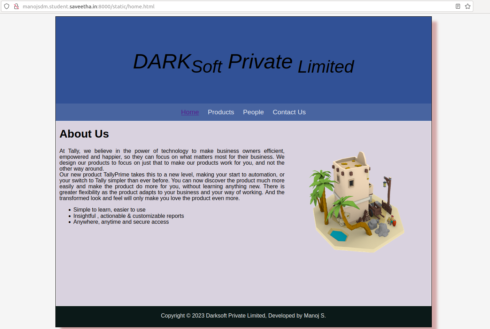
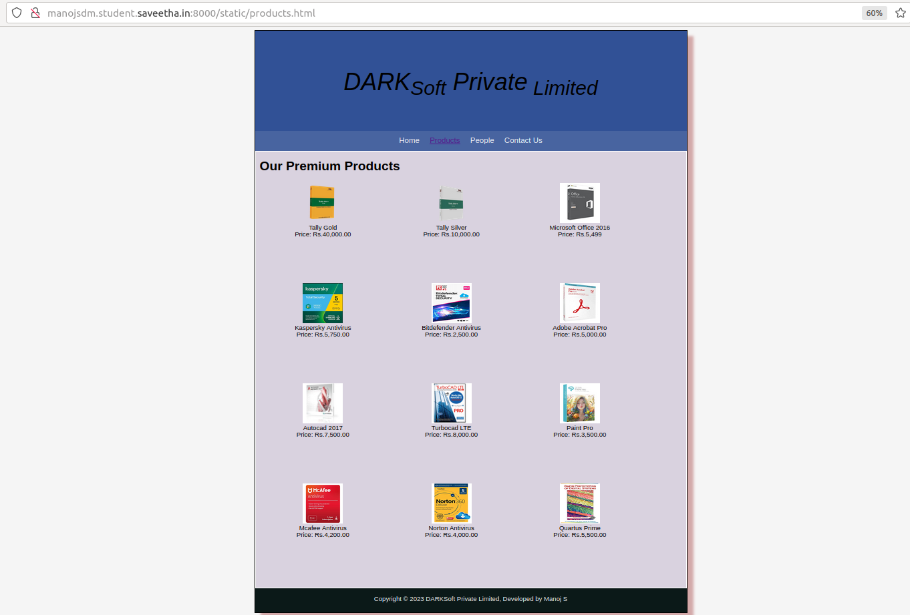
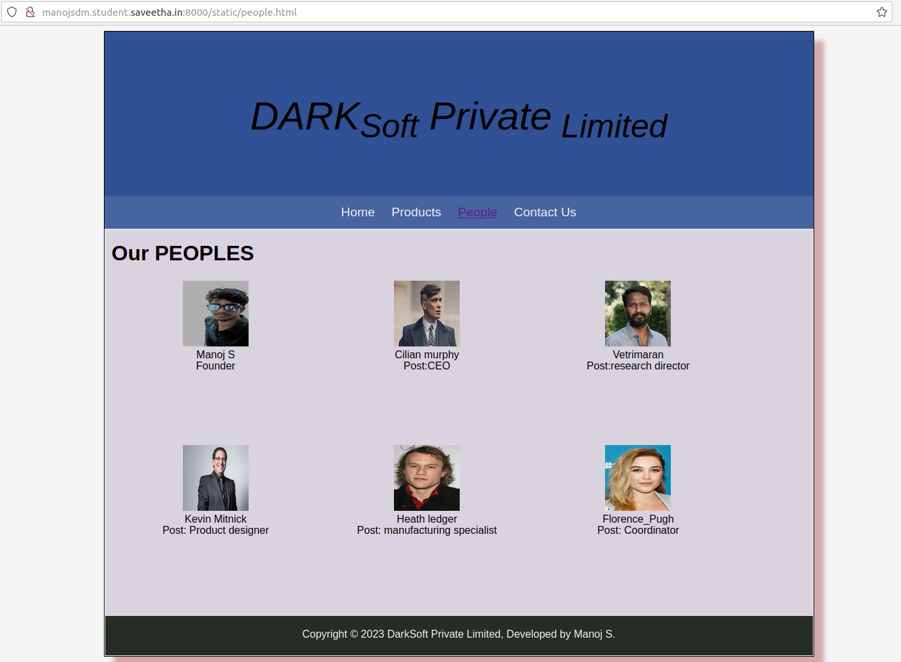
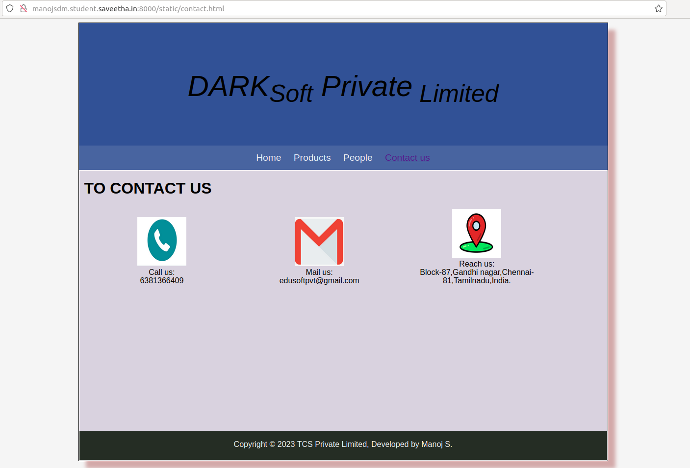

# Web Design for a Software Product Company

## AIM:

To design a static website for a software product company company.

## DESIGN STEPS:

### Step 1:

Requirement collection.

### Step 2:

Creating the layout using HTML and CSS.

### Step 3:

Updating the sample content.

### Step 4:

Choose the appropriate style and color scheme.

### Step 5:

Validate the layout in various browsers.

### Step 6:

Validate the HTML code.

### Step 6:

Publish the website in the given URL.

## PROGRAM :
```
Developed by : Manoj S
Reg no :212222100025
```
#### css:
```
* {
  box-sizing: border-box;
  font-family: Arial, Helvetica, sans-serif;
}
body {
  background-color: whitesmoke;
  color: #000000;
}
.container {
    
  width: 1080px;
  margin-left: auto;
  margin-right: auto;
  border-width: 1px 1px 1px 1px;
  border-style: solid;
  box-shadow: 15px 15px 8px rgb(211, 169, 169);
  background-color: #00287ecc;
}

.banner {
  display: block;
  width: 100%;
  height: 250px;
  text-align: center;
  font-style: italic;
  font-size: 60px;
  background-image: url("/static/css/banner1.png");
  background-size: 100% 100%;
  margin: 0px 0px 0px 0px;
  padding-top: 100px;
  color: black;
}

.menu {
  display: block;
  width: 100%;
  height: 50px;
  font-size: larger;
  background-color: #4864a0;
  text-align: center;
  padding-top: 15px;
  margin: 0px 0px 0px 0px;
  border-width: 1px;
}

.menuitem {
  display: inline-block;
  margin-left: 10px;
  margin-right: 10px;
}
.menuitemselected {
  display: inline-block;
  margin-left: 10px;
  margin-right: 10px;
  color: rgb(7, 7, 7);
}

.menuitem a {
  text-decoration: none;
  color: #ffffffec;
}

.content {
  display: block;
  width: 100%;
  background-color: #d9d2df;
  min-height: 500px;
  margin: 0px 0px 0px 0px;
  border-width: 1px;
  border-color: white;
  border-style: solid;
}
.homecontent {
  min-height: 500px;
  margin: 10px 10px 10px 10px;
}
.homecontent h1 {
  text-align: left;
}
.homecontent img {
  float: right;
  width: 400px;
  height: 300px;
  margin-left: 10px;
}

.contenttext {
  text-align: justify;
}

.productcontent {
  min-height: 500px;
  margin: 10px 10px 10px 10px;
}

.productcontent h1 {
  text-align: left;
}

.productitems {
  display: block;
}

.productitem {
  display: inline-block;
  width: 30%;
  height: 250px;
  text-align: center;
}

.productitem img {
  width: 100px;
  height: 100px;
  display: block;
}
.productitem .itemimage {
  display: block;
  margin-left: auto;
  margin-right: auto;
  width: 100px;
  margin-bottom: 5px;
}

.productitem .itemname {
  display: block;
}
.productitem .itemprice {
  display: block;
}

.footer {
  display: block;
  width: 100%;
  height: 60px;
  background-color: #040e01d7;
  text-align: center;
  padding-top: 20px;
  margin: 0px 0px 0px 0px;
  color: #f8f8f8;
}
```
#### home.html:
```
<!DOCTYPE html>
<html lang="en">
  <head>
    <title>DarkSoft Private Limited</title>
    <link rel="stylesheet" href="./css/layout.css" />
    <link rel="icon" href="./img/icon.png" type="image/x-icon" />
  </head>

  <body>
    <div class="container">
      <div class="banner">DARK<sub>Soft</sub> Private<sub> Limited</sub></div>
      <div class="menu">
        <div class="menuitemselected"><a href="/static/home.html">Home</a></div>
        <div class="menuitem"><a href="/static/products.html">Products</a></div>
        <div class="menuitem"><a href="/static/people.html">People</a></div>
        <div class="menuitem"><a href="/static/contact.html">Contact Us</a></div>
      </div>
      <div class="content">
        <div class="homecontent">
          <h1>About Us</h1>
          
          <div class="contenttext">
            At Tally, we believe in the power of technology to make business
            owners efficient, empowered and happier, so they can focus on what
            matters most for their business. We design our products to focus on
            just that to make our products work for you, and not the other way
            around.
            <br />
            Our new product TallyPrime takes this to a new level, making your
            start to automation, or your switch to Tally simpler than ever
            before. You can now discover the product much more easily and make
            the product do more for you, without learning anything new. There is
            greater flexibility as the product adapts to your business and your
            way of working. And the transformed look and feel will only make you
            love the product even more.
            <ul>
              <li>Simple to learn, easier to use</li>
              <li>Insightful , actionable & customizable reports</li>
              <li>Anywhere, anytime and secure access</li>
            </ul>
          </div>
        </div>
      </div>
      <div class="footer">
        Copyright &#169; 2023 Darksoft Private Limited, Developed by Manoj S.
      </div>
    </div>
  </body>
</html>
```
#### product.html :
```
<!DOCTYPE html>
<html lang="en">
  <head>
    <title>DarkSoft Private Limited</title>
    <link rel="stylesheet" href="./css/layout.css" />
    <link rel="icon" href="./img/icon.png" type="image/x-icon" />
  </head>

  <body>
    <div class="container">
      <div class="banner">DARK<sub>Soft</sub> Private<sub> Limited</sub></div>
      <div class="menu">
        <div class="menuitem"><a href="/static/home.html">Home</a></div>
        <div class="menuitemselected">
          <a href="/static/products.html">Products</a>
        </div>
        <div class="menuitem"><a href="/static/people.html">People</a></div>
        <div class="menuitem"><a href="/static/contact.html">Contact Us</a></div>
      </div>
      <div class="content">
        <div class="productcontent">    
          <h1>Our Premium Products</h1>
          <div class="productitems">
              <div class="productitem"> 
                  <div class="itemimage">
                  
                  </div>
                  <div class="itemname">Tally Gold</div>
                  <div class="itemprice">Price: Rs.40,000.00 </div>
              </div>
              <div class="productitem"> 
                  <div class="itemimage">
                  
                  </div>
                  <div class="itemname">Tally Silver</div>
                  <div class="itemprice">Price: Rs.10,000.00 </div>
              </div>
              <div class="productitem"> 
                  <div class="itemimage">
                  
                  </div>
                  <div class="itemname">Microsoft Office 2016</div>
                  <div class="itemprice">Price: Rs.5,499 </div>
              </div>
              <div class="productitem"> 
                  <div class="itemimage">
                  
                  </div>
                  <div class="itemname">Kaspersky Antivirus</div>
                  <div class="itemprice">Price: Rs.5,750.00 </div>
              </div>
              <div class="productitem"> 
                  <div class="itemimage">
                  
                  </div>
                  <div class="itemname">Bitdefender Antivirus</div>
                  <div class="itemprice">Price: Rs.2,500.00 </div>
              </div>
              <div class="productitem"> 
                  <div class="itemimage">
                  
                  </div>
                  <div class="itemname">Adobe Acrobat Pro</div>
                  <div class="itemprice">Price: Rs.5,000.00 </div>
              </div>
              <div class="productitem"> 
                  <div class="itemimage">
                  
                  </div>
                  <div class="itemname">Autocad 2017</div>
                  <div class="itemprice">Price: Rs.7,500.00 </div>
              </div>
              <div class="productitem"> 
                  <div class="itemimage">
                  
                  </div>
                  <div class="itemname">Turbocad LTE</div>
                  <div class="itemprice">Price: Rs.8,000.00 </div>
              </div>
              <div class="productitem"> 
                  <div class="itemimage">
                  
                  </div>
                  <div class="itemname">Paint Pro</div>
                  <div class="itemprice">Price: Rs.3,500.00 </div>
              </div>
              <div class="productitem"> 
                  <div class="itemimage">
                  
                  </div>
                  <div class="itemname">Mcafee Antivirus</div>
                  <div class="itemprice">Price: Rs.4,200.00 </div>
              </div>
              <div class="productitem"> 
                  <div class="itemimage">
                  
                  </div>
                  <div class="itemname">Norton Antivirus</div>
                  <div class="itemprice">Price: Rs.4,000.00 </div>
              </div>
              <div class="productitem"> 
                  <div class="itemimage">
                  
                  </div>
                  <div class="itemname">Quartus Prime</div>
                  <div class="itemprice">Price: Rs.5,500.00 </div>
              </div>
          </div>
          </div>        
      </div>
      <div class="footer">
        Copyright &#169; 2023 DARKSoft Private Limited, Developed by Manoj S
      </div>
    </div>
  </body>
</html>
```
#### people.html:
```
<!DOCTYPE html>
<html lang="en">
  <head>
    <title>DarkSoft Private Limited</title>
    <link rel="stylesheet" href="./css/layout.css" />
    <link rel="icon" href="./img/icon.png" type="image/x-icon" />
  </head>

  <body>
    <div class="container">
      <div class="banner">DARK<sub>Soft</sub> Private<sub> Limited</sub></div>
      <div class="menu">
        <div class="menuitem"><a href="/static/home.html">Home</a></div>
        <div class="menuitem"><a href="/static/products.html">Products</a></div>
        <div class="menuitemselected">
          <a href="/static/people.html">People</a>
        </div>
        
        <div class="menuitem"><a href="/static/contact.html">Contact Us</a></div>
      </div>
      <div class="content">
        <div class="productcontent">    
          <h1>Our PEOPLES</h1>
          <div class="productitems">
              <div class="productitem"> 
                  <div class="itemimage">
                  
                  </div>
                  <div class="itemname">Manoj S</div>
                  <div class="itemprice">Founder</div>
              </div>
              <div class="productitem"> 
                  <div class="itemimage">
                  
                  </div>
                  <div class="itemname">Cilian murphy</div>
                  <div class="itemprice">Post:CEO</div>
              </div>
             
              <div class="productitem"> 
                  <div class="itemimage">
                  
                  </div>
                  <div class="itemname">Vetrimaran</div>
                  <div class="itemprice">Post:research director</div>
              </div>
            
              <div class="productitem"> 
                  <div class="itemimage">
                  
                  </div>
                  <div class="itemname">Kevin Mitnick</div>
                  <div class="itemprice">Post: Product designer</div>
              </div> 

              <div class="productitem"> 
                  <div class="itemimage">
                  
                  </div>
                  <div class="itemname">Heath ledger</div>
                  <div class="itemprice">Post: manufacturing specialist </div>
              </div>

               <div class="productitem"> 
                  <div class="itemimage">
                  
                  </div>
                  <div class="itemname">Florence_Pugh</div>
                  <div class="itemprice">Post: Coordinator</div>
              </div>
          </div>        
      </div>
      <div class="footer">
        Copyright &#169; 2023 DarkSoft Private Limited, Developed by Manoj S.
      </div>
    </div>
  </body>
</html>
```
#### contact.html :
```
<!DOCTYPE html>
<html lang="en">
  <head>
    <title>DarksofSoft Private Limited</title>
    <link rel="stylesheet" href="./css/layout.css" />
    <link rel="icon" href="./img/icon.png" type="image/x-icon" />
  </head>

  <body>
    <div class="container">
      <div class="banner">DARK<sub>Soft</sub> Private<sub> Limited</sub></div>
      <div class="menu">
        <div class="menuitem"><a href="/static/home.html">Home</a></div>
        <div class="menuitem"><a href="/static/products.html">Products</a></div>
        <div class="menuitem"><a href="/static/people.html">People</a></div>
        <div class="menuitemselected">
          <a href="/static/contact.html">Contact us</a>
        </div>
      </div>
      <div class="content">
        <div class="productcontent">    
          <h1>TO CONTACT US</h1>
          <div class="productitems">
              <div class="productitem"> 
                  <div class="itemimage">
                  
                  </div>
                  <div class="itemname">Call us: </div>
                  <div class="itemprice">8248728575</div>
              </div>
              <div class="productitem"> 
                  <div class="itemimage">
                  
                  </div>
                  <div class="itemname">Mail us:</div>
                  <div class="itemprice">darksoftpvt@gmail.com</div>
              </div>
             
              <div class="productitem"> 
                  <div class="itemimage">
                  
                  </div>
                  <div class="itemname">Reach us:</div>
                  <div class="itemprice">Block-87,ESI mainroad ,Thathaneri,Madurai -18,Tamilnadu,India.</div>
              </div>
             

         </div>        
      </div>
      <div class="footer">
        Copyright &#169; 2023 TCS Private Limited, Developed by Manoj S.
      </div>
    </div>
  </body>
</html>
```
## OUTPUT:
### Home Page:

### products:

### peoples: 

### contact :

## Result:

Thus a website is designed for the software product company and the HTML,CSS code are validated.
